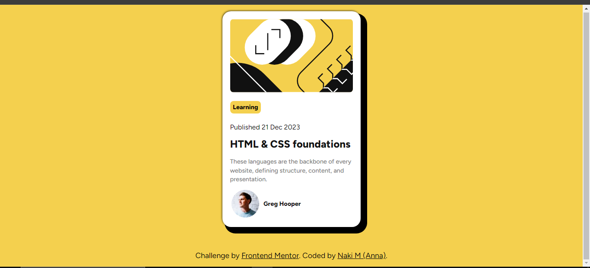

# Frontend Mentor - Blog preview card solution

This is a solution to the [Blog preview card challenge on Frontend Mentor](https://www.frontendmentor.io/challenges/blog-preview-card-ckPaj01IcS). Frontend Mentor challenges help you improve your coding skills by building realistic projects. 

## Table of contents

- [Overview](#overview)
  - [The challenge](#)
  - [Screenshot](#screenshot)
  - [Links](#links)
- [My process](#my-process)
  - [Built with](#)
  - [What I learned](#what-i-learned)
  - [Continued development](#continued-development)
- [Author](#author)


## Overview

### The challenge

- This project is a solution to the Blog Preview Card challenge from Frontend Mentor. It demonstrates the use of HTML, CSS, and Flexbox to create a responsive and visually appealing blog card component.

Users should be able to:

- See hover and focus states for all interactive elements on the page

### Screenshot



### Links

- Solution URL: [https://github.com/Naki93/frontend-blog-preview](https://your-solution-url.com)
- Live Site URL: [https://frontend-blog-preview.vercel.app/](https://your-live-site-url.com)

## My process

### Built with

- Semantic HTML5 markup
- CSS custom properties
- Flexbox


### What I learned

I learned how to use css custom properties to represent values to be reused throughout the document
```css
:root{
--primaryColor: hsl(47, 88%, 63%);
--whiteColor:hsl(0, 0%, 100%);
--greyColor: hsl(0, 0%, 50%);
--blackColor: hsl(0, 0%, 7%);
}

body{
    background-color: var(--primaryColor);
}

.card{
  box-shadow: 
        -1px -1px 5px -1px var(--blackColor), 
         10px 10px 0 5px var(--blackColor); 
}
```
### Continued development

As part of my commitment to continuous improvement, I am focusing on enhancing my understanding and application of various CSS units and properties, which are fundamental to responsive and accessible web design. Specifically, I am concentrating on:

 CSS Units:

- rem: Root em unit, which is relative to the root element (usually the <html> element).
- em: Relative to the font-size of the element's parent.
- px: Pixels, an absolute unit.
- %: Percentages, relative to the parent element's dimensions.
Mastering these units will allow me to create more flexible and scalable layouts.

max-width in Images:

Understanding and utilizing max-width to ensure images are responsive and adapt well to different screen sizes without losing their aspect ratio.
Through continuous learning and practical application of these concepts, I aim to improve the responsiveness, accessibility, and overall user experience of the web applications I develop. This ongoing education will ensure my skills remain current and effective in the ever-evolving landscape of web development.

## Author

- Website - [Anna M]


